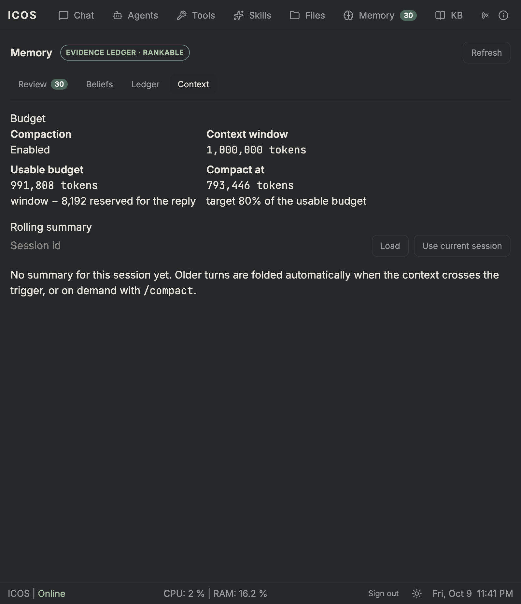
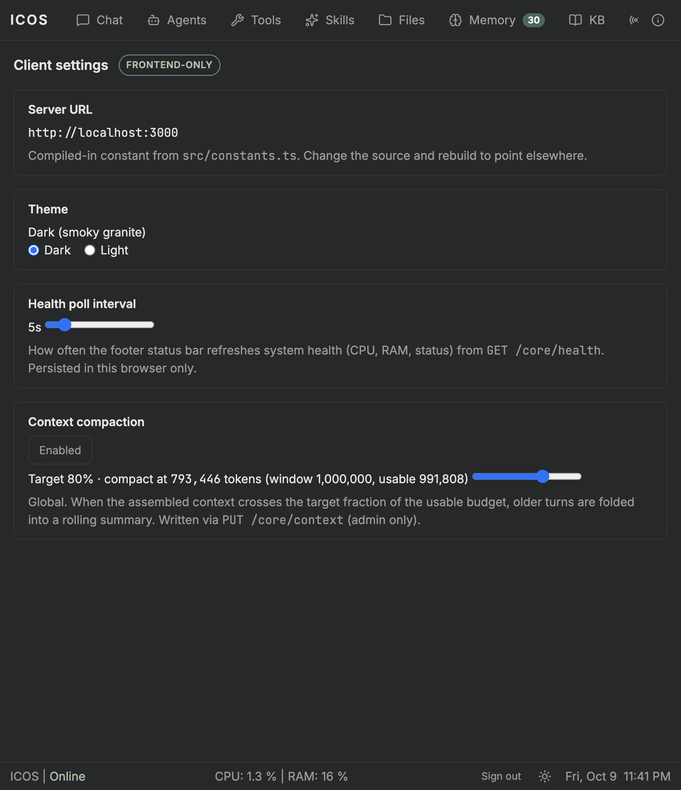

# M20.6 — Context budget & compaction: evidence

> Status: **verified** (2026-10-10). Slices **M20.6.1** (budget & accounting),
> **M20.6.2** (compaction + `/compact`), **M20.6.3** (inspectable + settings).
> Per-slice evidence; M20 is in progress.

## Design

- **Budget.** `LLM_CONTEXT_WINDOW` (default `1000000`) minus
  `LLM_MAX_OUTPUT_TOKENS` (`8192`) is the usable budget; compaction triggers at
  `CONTEXT_COMPACTION_TARGET` (default `0.8`, clamped 0.5–0.95) of it. A
  best-effort `/models` probe is off by default (`CONTEXT_WINDOW_AUTODETECT`).
- **Compaction.** `ContextCompactionService` folds the oldest turns into a
  rolling summary, keeping the newest 8 messages verbatim. The fold ends on a
  user-message boundary, so a tool-call/result sequence is never split. One
  `context_summaries` row per session stores `covered_upto_message_id` — the
  re-trigger guard — so a covered range is never re-summarized. The transcript
  is untouched (context-only). Summarization uses the **memory** role when
  configured, bounded by `CONTEXT_COMPACTION_TIMEOUT_MS` (default 20s) and
  falling back to the conversation model on absence, failure, or timeout.
- **Turn hook.** `prepareTurn` builds history only from messages after the
  covered range, adds a `<conversation_summary>` band, and — when the estimate
  crosses the trigger — compacts once and rebuilds. Fail-soft.
- **`/compact`.** A manual slash command (fold now), in the catalog (so Discord
  registers it too).
- **Inspectable + settings.** `/status` gains a `Summary:` line;
  `GET /core/context` (settings), `PUT /core/context` (admin; target/enabled,
  persisted to `CONTEXT_SETTINGS_PATH`), `GET /core/context/summary?sessionId=`.
  The client adds a Memory-tab **Context** segment and a Client-settings target
  slider + enable toggle.

## Unit

Core **1208 unit / 67 e2e**; client **200 tests**; `tsc`/`eslint` + `ng build`
clean. New tests: budget math + trigger boundary; compaction (folds older
turns, keeps recent, re-trigger guard, whole-turn boundary, summarizer
fallback); e2e (`GET`/`PUT /core/context`, `/compact` folds ~20 messages into a
stored summary, transcript length unchanged); client service + panel.

## Live

```
GET  /core/context                             → 200 {contextWindow:1000000, usable:991808,
                                                       trigger:793446, target:0.8, enabled:true}
PUT  /core/context {target:0.9}                → 200 target 0.9
PUT  /core/context {target:0.8}                → 200 target 0.8
PUT  /core/context {target:"nope"}             → 400
POST /core/conversation {turns}                → session, 10 messages
GET  /core/context/summary?sessionId=          → 200 summary: null
POST /core/conversation {message:"/compact"}   → 200
   "Compacted 2 older message(s) into the rolling summary (~139 tokens). The transcript is unchanged."
GET  /core/context/summary?sessionId=          → 200 covers up to message 356 · ~139 tokens
POST /core/conversation {message:"/status"}    → "Summary: ~139 tokens · covers up to message 356 · …"
GET  /core/conversation/:id                    → 10 messages (unchanged — context-only)
DELETE /core/sessions/:id                      → 200 (cleanup)
```

### ⚠️ Memory-role note

The live summarizer first tried the local memory role (`gemma4:e4b`), which was
saturated by concurrent memory extraction and hit the 20s bound — the
conversation model served the summary via the documented fallback (logged:
`Memory-role summarizer failed ([ollama] LLM request aborted); falling back to
the conversation model`). Memory extraction itself logged 60s endpoint timeouts
during the run: a **pre-existing** local-model capacity issue, not introduced
here. Without the bound, a cold model would have stalled compaction for the full
60s endpoint timeout — the bound exists precisely for that.

## Client

`Memory → Context` (budget read-out + rolling summary):



`Client settings → Context compaction` (target slider + enable toggle):


