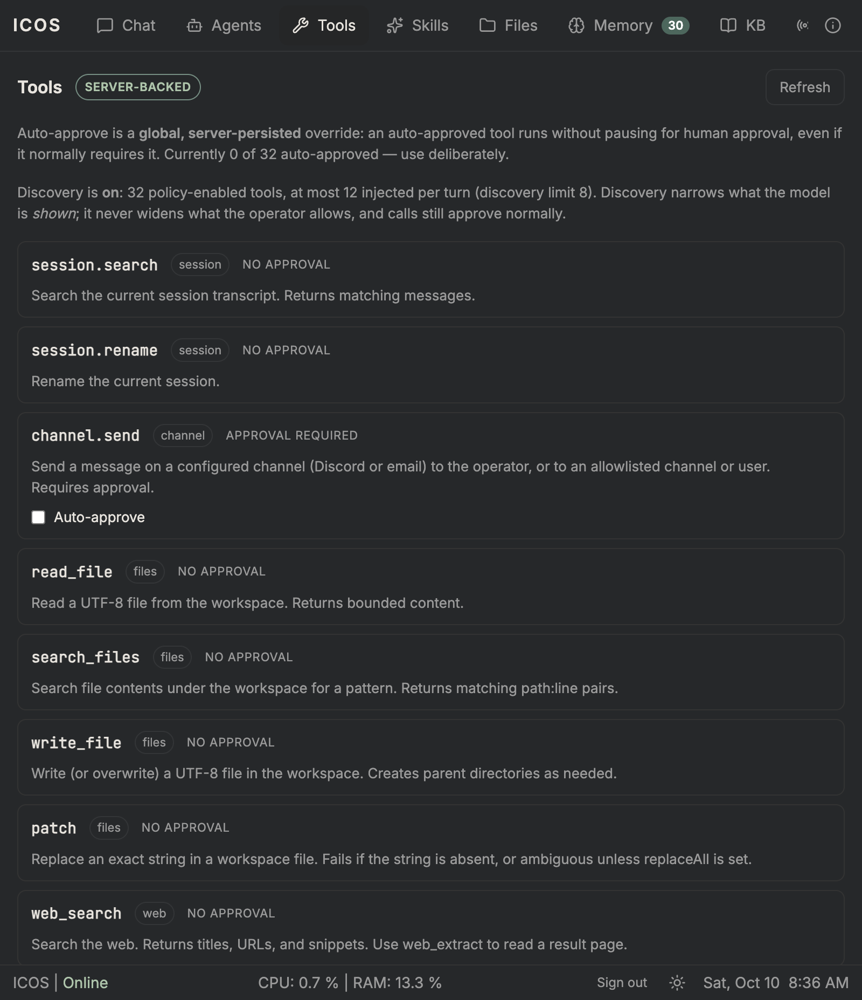

# M20.7 — Tools out of context: evidence

> Status: **verified** (2026-10-10). Slices **M20.7.1** (discovery + selector +
> budget), **M20.7.2** (pull paths), **M20.7.3** (surface + docs). Last M20
> sub-milestone.

## Design

- **Discovery** (`tool-discovery.ts`) mirrors `skill-discovery.ts`: pure,
  deterministic, no LLM. Ranks the turn input's tokens against tool **name**
  (+2), **toolset** (+2), and **description** (+1). `tool-selector.ts` is the
  budget seam (top-budgeted by default).
- **Injection** (`ToolSurfaceService`): the operator policy (`resolveToolPolicy`)
  defines the **universe**; each turn injects a bounded subset — always-on core
  ∪ staged pulls ∪ discovered — capped at `TOOLS_MAX_PER_TURN`. Recomputed per
  proposal round, so a pull lands on the next round.
- **Pull paths:** the always-on `search_platform_tools` meta-tool (model-driven;
  resolves + stages matches, bounded by `TOOLS_PULL_MAX_RESULTS` /
  `TOOLS_PULL_MAX_PER_TURN`) and `/tools pull <query>` (operator; one-shot for
  the next turn). `ToolPullStore` is strictly per-turn — never an unbounded
  collection of schemas.
- **Invariant — discoverability ≠ authorization:** `injected ⊆ universe`.
  Discovery and pulls can only *narrow* what the model is shown; they never
  widen the operator's allowed set, never grant execution, and never bypass
  approvals. `allowedTools` is the injected set, so every call — discovered,
  always-on, or pulled — goes through the existing `ToolRegistry.validate` +
  approval path. A policy-disabled tool is never injected *or* callable.
- **Default:** `TOOLS_DISCOVERY_ENABLED=true` with a conservative budget;
  `false` restores inject-everything (pre-M20.7). `/tools status` and the Tools
  tab show the resolved state + bounds.

## Unit

Core **1234 unit / 68 e2e**; web **200 tests**; `tsc`/`eslint` + `ng build`
clean. New tests: discovery ranking/recall/toolset/missing; selector budget;
surface injection/budget/policy-disabled exclusion/staged pulls/pull bound;
conversation-level injection + per-round reinjection + disabled mode; `/tools`
command; e2e discovery of a tool absent from the initial offer, executed
through the normal authorization path.

## Live

```
GET  /core/tools/discovery → 200 {enabled:true, universe:32,
     bounds:{maxPerTurn:12, discoveryLimit:8, pullMaxResults:5,
             pullMaxPerTurn:2, alwaysOn:[search_platform_tools,memory,todo]}}
POST /core/conversation {"/tools status"} → "Tools: 32 policy-enabled. Discovery: on · max 12/turn …"
POST /core/conversation {"/tools list"}   → 32 policy-enabled
POST /core/conversation {"/tools pull schedule a daily reminder"}
     → 200 "Pulled 1 tool(s) for the next turn: - cronjob_manage"
```

### Meta-tool: a tool absent from the initial offer, executed

Forcing a clean miss (compose env override: `TOOLS_ALWAYS_ON=search_platform_tools`,
`TOOLS_MAX_PER_TURN=1`, so the injected set is just the meta-tool), a real turn
— *"Set up a daily reminder at 8am to stretch. Use a tool."* — produced:

```
turn → 200 | tool: { name: "cronjob_manage" }
reply: "Created it … Name daily-stretch-reminder · Schedule 0 8 * * * …"

[ToolExecutionService] search_platform_tools("create a daily recurring reminder
  at 8am to stretch") -> … cronjob_manage …
```

So `cronjob_manage` was **not** in the initial schema set; the model called the
meta-tool, the harness resolved + staged it, it was reinjected on the next
round, and the call executed **through the normal authorization path** (the
`unpermitted_tool` gate would have refused it otherwise). The override was
removed and the surface restored to the defaults afterwards.

## Client

Tools tab shows the resolved discovery state + bounds:



## Notes

- The deterministic heuristic is deliberately simple and can over-inject (e.g.
  the token `use` is a substring of `pause`), which errs toward *showing* more,
  never toward hiding something the operator enabled. The bounds cap the cost.
- `docs/usage.md` documents the default, the limits, the pull paths, and the
  discoverability-vs-authorization distinction.
