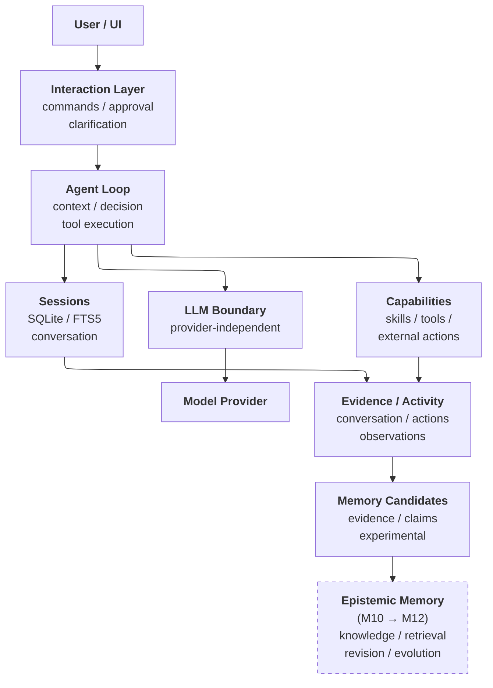

# ICOS

<center>


</center>

---

## What is ICOS?

**ICOS** (**I**SABEL **C**ognitive **O**perating **S**ystem) is a from-scratch cognitive agent runtime built to investigate a simple question:

> **What is the minimum architecture required to give an agent persistent memory, useful knowledge, and meaningful agency?**

ICOS is not a wrapper around an existing agent framework.

**The runtime is the harness.**

The agent loop, interaction layer, model boundary, session persistence, memory systems, skills, and future autonomous capabilities are being developed as parts of one deliberately small system.

The goal is not to reproduce a biological model of cognition. Instead, ICOS is an experimental platform for identifying which architectural mechanisms actually produce useful changes in agent behaviour.

> **Trying it out?** Start with **[USAGE.md](USAGE.md)** (setup, configuration,
> and running the stack). Before exposing it beyond your machine, read
> **[docs/security.md](docs/security.md).** To understand what the platform
> actually does — feature by feature, and how each is verified — read
> **[ARCHITECTURE.md](ARCHITECTURE.md)**.

---

## Lineage

ICOS is the third generation of a personal cognitive-architecture research
line — hence "v3", which refers to the *generation*, not to ICOS's own
version. ICOS is the first release under its own name.

| Generation | Name       |                                                |
| :--------: | :--------- | :--------------------------------------------- |
|    v1      | **AURORA** |                                                |
|    v2      | **ISABEL** | A large, biologically inspired architecture.   |
|    v3      | **ICOS**   | **ISABEL Cognitive Operating System**.         |

ISABEL (v2) explored a much more elaborate approach to cognitive architecture, incorporating biologically inspired mechanisms including persistent identity, multiple memory systems, state modulation, autonomous action selection, knowledge structures, and more.

That work was valuable, but it also exposed a problem:

**As the architecture became more complex, the architecture itself became a confounding variable.**

When an agent changed its behaviour, it became increasingly difficult to determine whether the change came from a particular mechanism or from its interaction with everything surrounding it.

ICOS takes the opposite approach.

Start small.

Add capabilities deliberately.

Measure what changes.

Keep the system understandable.

> **If a capability cannot justify its complexity, it doesn't belong in the architecture yet.**

---

## Design Goals

ICOS is being built around a few principles:

### Small enough to understand

The core should remain small enough that the entire agent loop can be understood without reconstructing a distributed system.

### Provider independent

The agent should not be coupled to a particular model provider.

ICOS communicates through an OpenAI-compatible interface, allowing the underlying model to be changed without rebuilding the runtime around it.

Current and planned providers include local and external model backends such as Ollama, llama.cpp, OpenCode, and OpenRouter.

### Evidence-driven

Capabilities are introduced incrementally.

Each milestone has a specific question, implementation target, and verification evidence.

The intention is to understand not only **whether something works**, but **what changed when it was introduced**.

### Experimental rather than general-purpose

ICOS is not intended to compete with general-purpose agent frameworks.

It exists primarily as a controlled environment for experimenting with agent architecture.

---

## Current Status

**M1–M15.5 are complete, and the security-hardening milestone (S1–S6) is complete.**

The current system provides:

- A working conversation loop
- REST API
- Token streaming via SSE
- Persistent SQLite sessions
- FTS5 session recall
- Memory-candidate extraction
- An evidence ledger for extracted candidates
- Provider-independent LLM integration
- Slash commands
- Structured human approvals
- Structured clarification requests
- Standard-format skills support
- Tool integration with a durable invocation ledger
- Agent orchestration (bounded plan → act → observe loop)
- Epistemic memory (evidence → provenance-traced beliefs, human-approved
  promotion, contradiction handling with a clarification queue)
- Turn-time recall (lexical + semantic + associative surfaces, ranked
  with confidence gating and provenance lenses, band-separated context
  that never confuses memory with user speech)
- Memory dynamics (bounded reinforcement, honest decay, revision with
  walkable history, deliberate retirement, salience apart from truth,
  temporal navigation)
- Contradiction transparency in the web client (paired belief links,
  negation markers, parked-question surfacing)
- MCP client support (consumes standard Model Context Protocol servers:
  namespaced tools bridged into the agent loop, approval-gated execution
  with durable records, resources and prompt templates behind a
  read-only fetch surface, no-restart catalog reload, per-server health)
- A persistent persona (an immutable, file-backed core the system cannot
  rewrite, an evolving reviewed identity / user / relationship layer,
  grounding into session context, and a review queue in the web client)
- Drift detection (structural signals plus an honestly-calibrated,
  advisory semantic signal, with finding reconciliation and a reporting
  surface)
- Hallucination mitigation (deterministic claim/evidence consistency
  checks, optional provider-agnostic secondary-model verification whose
  disagreement is recorded rather than auto-resolved, and explicit,
  logged mitigations — never a silent rewrite)
- Security posture (loopback-by-default binding, authentication with a
  bootstrap token, an encrypted secret vault, and an LLM provider
  registry selected at runtime with key references resolved through the
  vault) — managed from the web client (MCP servers, providers, secrets)

Development is active and the architecture is expected to change substantially as new capabilities are introduced.

---

## Milestones

ICOS is being developed as a sequence of increasingly capable experiments.

|  Milestone   | Question                                                                      |
| :----------: | :---------------------------------------------------------------------------- |
|    **M1**    | _Can it talk?_                                                                |
|    **M2**    | _Can it stream?_                                                              |
|    **M3**    | _Can it remember what happened?_                                              |
|    **M4**    | _Can it notice potentially meaningful things?_                                |
|    **M5**    | _Can I change its brain without changing its body?_                           |
|    **M6**    | _Can a human interact with it properly?_                                      |
|    **M7**    | _Can it acquire capabilities?_                                                |
|    **M8**    | _Can it actually use those capabilities?_                                     |
|    **M9**    | _Can it autonomously complete a task?_                                        |
|   **M10**    | _Can it form knowledge?_                                                      |
|   **M11**    | _Can it retrieve and use that knowledge?_                                     |
|   **M12**    | _Can that knowledge evolve?_                                                  |
|   **M13**    | _Can it use capabilities provided by other systems?_                          |
|   **M14**    | _Can it maintain a persistent persona?_                                       |
|   **M15**    | _Can it detect and correct its own drift?_                                    |
|   **M16**    | _Can it communicate through external channels?_                               |
|   **M17**    | _Can it autonomously select and execute actions?_                             |
|   **M18**    | _Can it perceive the world beyond conversation?_                              |
|   **M19**    | _Can it delegate work to other agents?_                                       |
|   **M20**    | _Can it react to external events without requiring a conversational turn?_    |
|   **M21**    | _Can it steward its own knowledge base?_                                      |
| **Deferred** | **_Episodic consolidation:_** _Can experiences be abstracted into knowledge?_ |
| **Deferred** | **_Source synchronization:_** _Can knowledge stay aligned with the world?_    |

Each milestone is tracked in `.reference/plans/` (plans and evidence), with
completed plans under `.reference/plans/closed/` and their verification under
`.reference/plans/evidence/`.

The intent is for the repository to document the development process rather than simply present the final architecture.

---

## Architecture

At its current stage, ICOS intentionally has a small architecture.



Some components shown above represent planned capabilities rather than fully implemented subsystems. The architecture grows as each milestone provides a reason to introduce the next layer.

---

## Repository Structure

The project is organized around the runtime, the web client, and the
experimental evidence behind each milestone.

```text
core/                   # ICOS runtime (NestJS)
web-client/             # Angular web client
docker-compose.yml      # Supported launch path (core service)
docker-compose-dmr.yml  # DMR override: models served in-stack (see bin/dmr)
bin/dmr                 # Shorthand for the DMR variant
docs/                   # User-facing docs (security, blueprints, sample skills)
.reference/             # Plans, evidence, and planning notes
ARCHITECTURE.md         # Plain-English architecture and feature guide
INDEX.md                # Full repository map
USAGE.md                # Setup, configuration, and operation
```

See **[INDEX.md](INDEX.md)** for the complete annotated map.

As the project grows, this section will be expanded to document significant architectural boundaries and development conventions.

---

## Research Direction

ICOS is ultimately intended to support experiments around agent behaviour and architecture.

Some of the questions motivating future development include:

- Does persistent memory improve behavioural continuity?
- Does explicit epistemic memory reduce recurring errors?
- Does persistent persona remain stable across sessions and model changes?
- Does autonomous action selection produce useful agency?
- Which mechanisms improve capability versus merely increasing complexity?
- Can knowledge be maintained and evolved without requiring an increasingly complicated architecture?
- How much of an agent's behaviour can be explained by a relatively small runtime?

The architecture is therefore a means to an end.

**The interesting part is what changes when the architecture changes.**

---

## Project Status

ICOS is an active personal research and software project.

It is **not production software** and should be considered experimental.

The architecture, APIs, configuration, and milestone definitions may change without maintaining backward compatibility.

The repository's milestone plans and evidence are intended to make those changes visible rather than hiding the experimental nature of the project.

---

## Contributing

ICOS is primarily a personal research project and is not currently seeking additional maintainers.

That said, the project is public and feedback is welcome.

If you experiment with ICOS, find a problem, have a question about an architectural decision, or discover an interesting behavioural result, feel free to share it.

Questions are particularly useful when they challenge an assumption behind the architecture.

---

## License

ICOS is available **free for noncommercial use** under the [PolyForm Noncommercial License 1.0.0](./LICENSE.md).

Commercial use requires a separate license.

See [COMMERCIAL-LICENSE.md](./COMMERCIAL-LICENSE.md) for details.

---

## Related Research

ICOS is the continuation of research previously conducted under the ISABEL name.

The v2 work explored increasingly complex biologically inspired cognitive architecture.

ICOS deliberately takes a different methodological approach: **start with a minimal architecture and reintroduce capabilities incrementally.**

The objective is not to build the most elaborate agent architecture possible.

It is to discover **which parts actually matter**.
